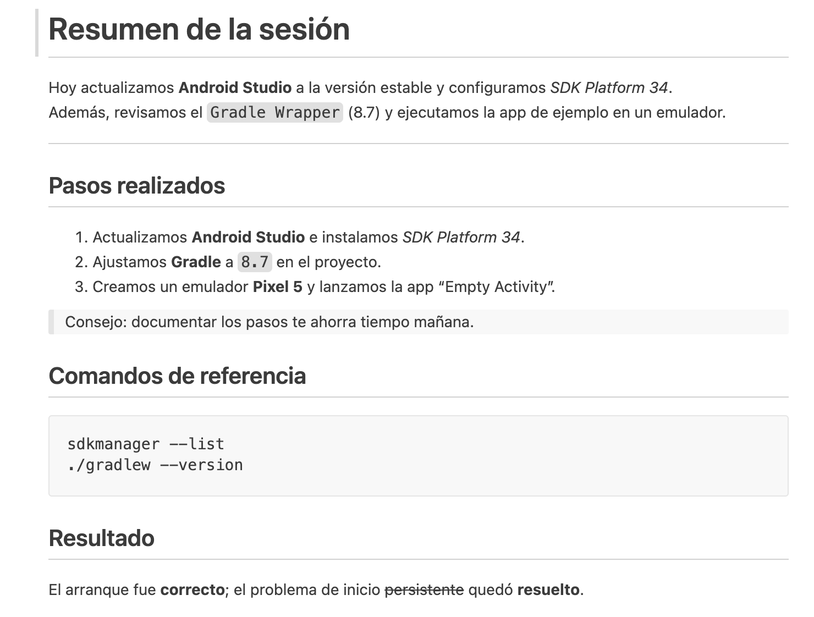

# Actividad 1

## Instrucciones

1. Crea una carpeta en `/alumnos/tu-nombre/Actividad-1` y dentro un fichero README.md que 
partiendo del `texto de partida` muestre la `Salida esperada`.

--- 

## Texto de partida 
```text
Resumen de la sesión
Hoy actualizamos Android Studio a la versión estable y configuramos SDK Platform 34.
Además, revisamos el Gradle Wrapper (8.7) y ejecutamos la app de ejemplo en un emulador.
Pasos realizados
Actualizamos Android Studio e instalamos SDK Platform 34.
Ajustamos Gradle a 8.7 en el proyecto.
Creamos un emulador Pixel 5 y lanzamos la app “Empty Activity”.
Consejo: documentar los pasos te ahorra tiempo mañana.
Comandos de referencia
sdkmanager --list
./gradlew --version
Resultado
El arranque fue correcto; el problema de inicio persistente quedó resuelto.
```
---
## Salida esperada
