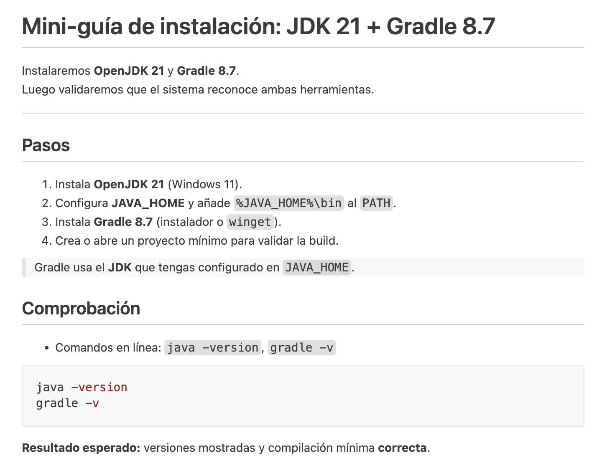

# Actividad 2

## Instrucciones

1. Crea una carpeta en `/alumnos/tu-nombre/Actividad-2` y dentro un fichero README.md que 
partiendo del `texto de partida` muestre la `Salida esperada`.

---

## Texto de partida
```plaintext
Mini-guía de instalación: JDK 21 + Gradle 8.7
Instalaremos OpenJDK 21 y Gradle 8.7.
Luego validaremos que el sistema reconoce ambas herramientas.
Pasos
Instala OpenJDK 21 (Windows 11).
Configura JAVA_HOME y añade %JAVA_HOME%\bin al PATH.
Instala Gradle 8.7 (instalador o winget).
Crea o abre un proyecto mínimo para validar la build.
Gradle usa el JDK que tengas configurado en JAVA_HOME.
Comprobación
Comandos en línea: java -version, gradle -v
java -version
gradle -v
Resultado esperado: versiones mostradas y compilación mínima correcta.
```

---
## Salida esperada

