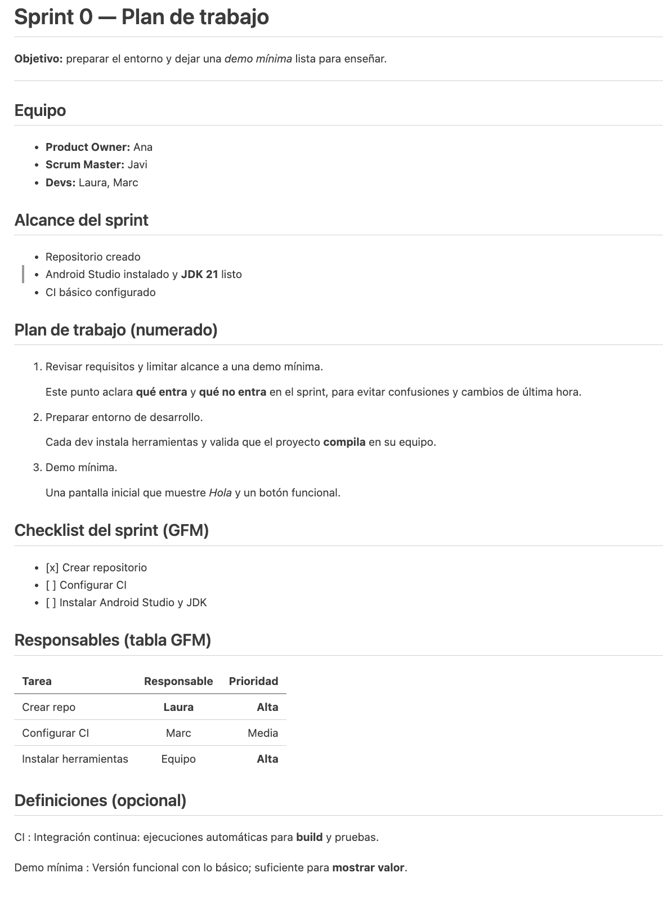

# Actividad 3

## Instrucciones

1. Crea una carpeta en `/alumnos/tu-nombre/Actividad-3` y dentro un fichero README.md que 
partiendo del `texto de partida` muestre la `Salida esperada`.

---

## Texto de partida
```plaintext
Incidencia: login devuelve 401
El login contra la API devuelve 401 Unauthorized pese a usar credenciales válidas.
La conectividad con el servidor es correcta, así que revisamos la petición.
Síntomas
El usuario introduce credenciales válidas; la API responde 401. \
Conectividad OK (no es un problema de red).
Acciones
Endpoint: POST /api/v1/login
Cabeceras a revisar: Content-Type: application/json
curl -i -X POST https://api.ejemplo.com/api/v1/login \
  -H "Content-Type: application/json" \
  -d '{"email":"demo@ejemplo.com","password":"demo123"}'
“No puedo iniciar sesión desde esta mañana.” — cliente
Conclusión
La causa más probable es un header ausente o un campo mal escrito (p. ej., email vs. username).
Próxima acción: corregir la request y repetir la prueba (esperamos 200 OK y token de sesión).
Estado: incidencia abierta → en revisión.
```

---
## Salida esperada

