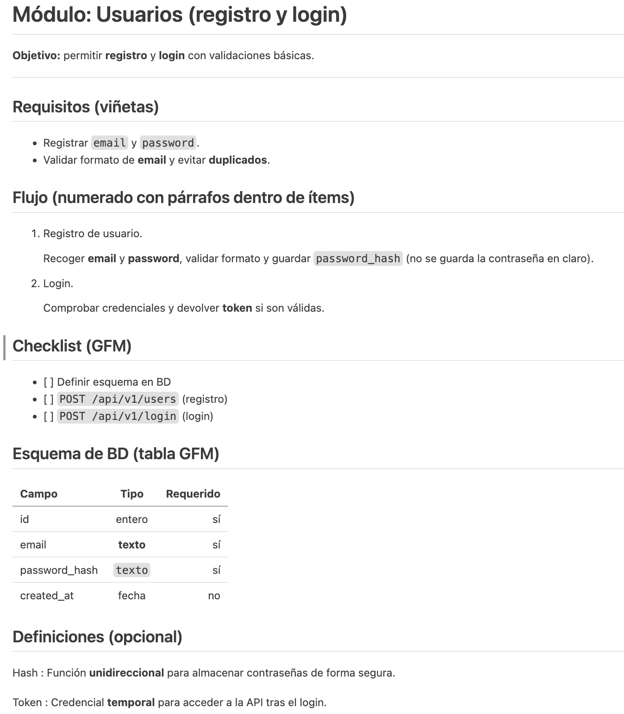

# Actividad 4

## Instrucciones

1. Crea una carpeta en `/alumnos/tu-nombre/Actividad-4` y dentro un fichero README.md que 
partiendo del `texto de partida` muestre la `Salida esperada`.

---

## Texto de partida
```plaintext
Módulo: Usuarios (registro y login)
Objetivo: permitir registro y login con validaciones básicas.
Requisitos (viñetas)
Registrar email y password.
Validar formato de email y evitar duplicados.
Flujo (numerado con párrafos dentro de ítems)
Registro de usuario.
Recoger email y password, validar formato y guardar password_hash (no se guarda la contraseña en claro).
Login.
Comprobar credenciales y devolver token si son válidas.
Checklist (GFM)
[ ] Definir esquema en BD
[ ] POST /api/v1/users (registro)
[ ] POST /api/v1/login (login)
Esquema de BD (tabla GFM)
Campo	Tipo	Requerido
id	entero	sí
email	texto	sí
password_hash	texto	sí
created_at	fecha	no
Definiciones (opcional)
Hash : Función unidireccional para almacenar contraseñas de forma segura.
Token : Credencial temporal para acceder a la API tras el login.
```

---
## Salida esperada

