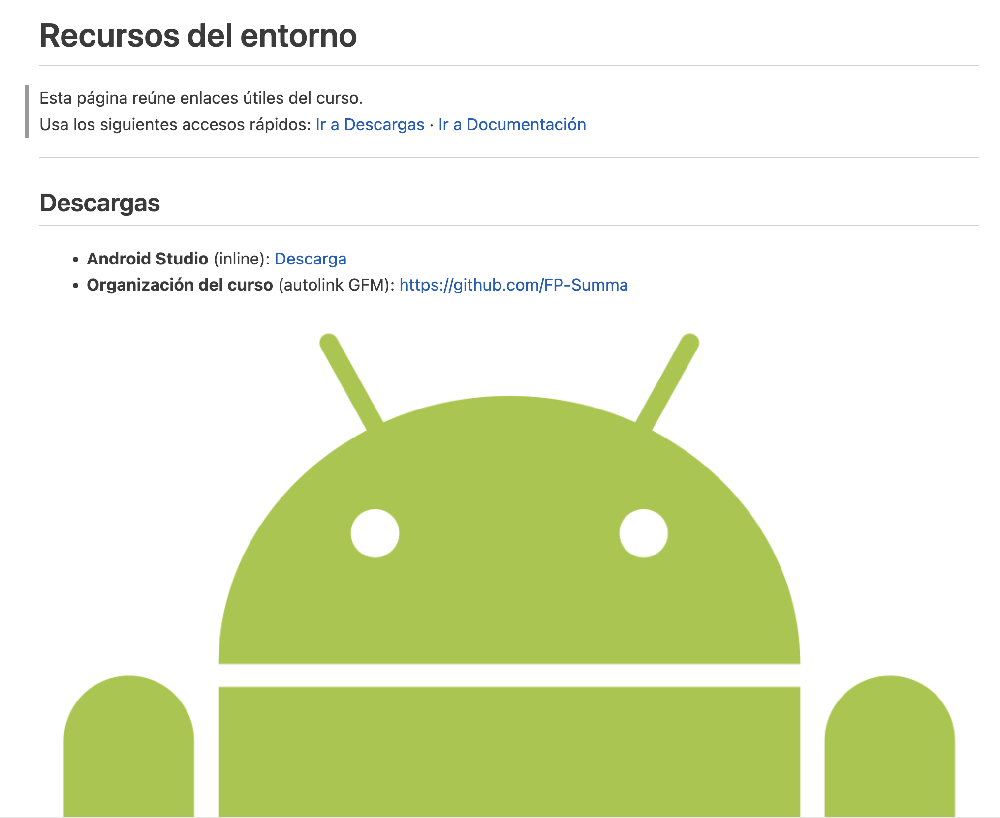
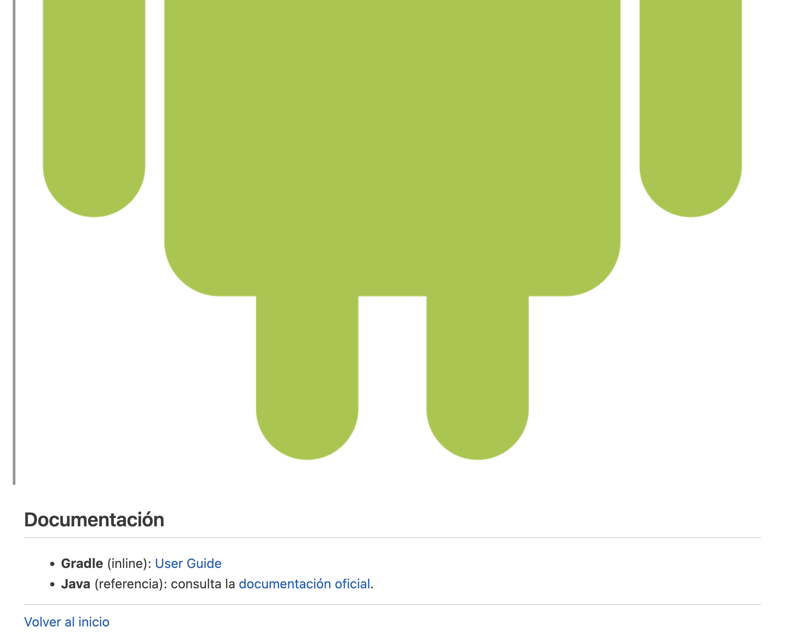

# Actividad 5

## Instrucciones

1. Crea una carpeta en `/alumnos/tu-nombre/Actividad-5` y dentro un fichero README.md que 
partiendo del `texto de partida` muestre la `Salida esperada`.

---

## Texto de partida
```plaintext
Recursos del entorno
Esta página reúne enlaces útiles del curso.
Usa los siguientes accesos rápidos: Ir a Descargas · Ir a Documentación
Descargas
Android Studio (inline): Descarga
Organización del curso (autolink GFM): https://github.com/FP-Summa
Acerca de Android Studio
Documentación
Gradle (inline): User Guide
Java (referencia): consulta la documentación oficial.
Volver al inicio
```

---
## Salida esperada


