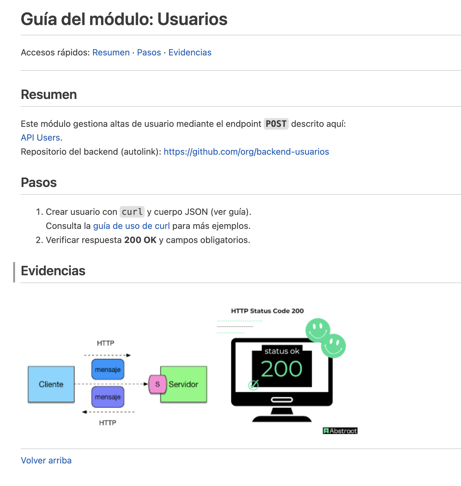

# Actividad 5

## Instrucciones

1. Crea una carpeta en `/alumnos/tu-nombre/Actividad-5` y dentro un fichero README.md que 
partiendo del `texto de partida` muestre la `Salida esperada`.

---

## Texto de partida
```plaintext
Guía del módulo: Usuarios
Accesos rápidos: Resumen · Pasos · Evidencias
Resumen
Este módulo gestiona altas de usuario mediante el endpoint POST descrito aquí:
API Users.
Repositorio del backend (autolink): https://github.com/org/backend-usuarios
Pasos
Crear usuario con curl y cuerpo JSON (ver guía).
Consulta la guía de uso de curl para más ejemplos.
Verificar respuesta 200 OK y campos obligatorios.
Evidencias
Diagrama de arquitectura del módulo Respuesta 200 OK
Volver arriba
```

---
## Salida esperada

